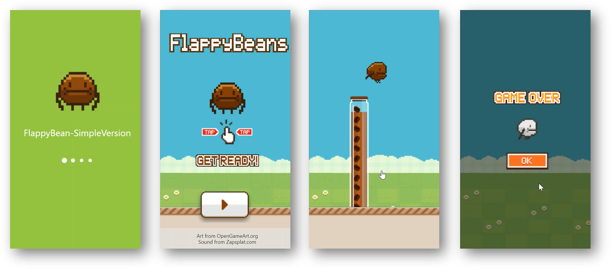
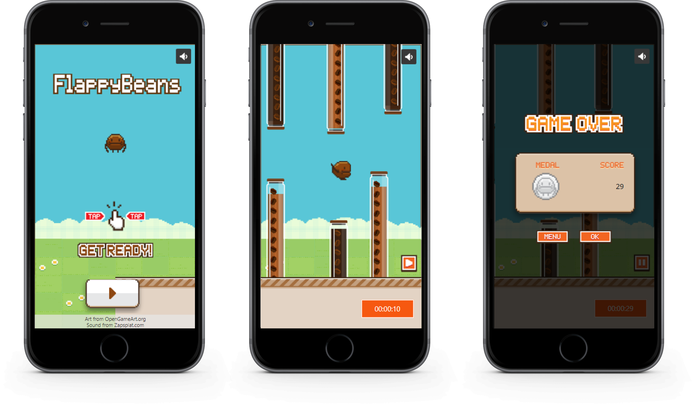

# PowerApps Game Flappy Bean
Do you remember the famous Flappy Bird? 🐦

I rebuilt the game using PowerApps

Art from OpenGameArt.org

- [Flappy Bean Media files](https://opengameart.org/content/flappy-beans)

Sound from Zapsplat.com
- [Audio Hit](https://www.zapsplat.com/music/cartoon-bird-hit-impact-squawk-1/)
- [Audio Jump](https://www.zapsplat.com/music/cartoon-bounce-jump-spring-1/)
- [Audio Background Music](https://www.zapsplat.com/music/game-music-action-retro-8-bit-style-bouncy-hard-dance-track-with-electronic-synths-and-drums/)

## Demo
### Flappy Beans V1 - Simple Version 
One obstacle - [Get the app FlappyBeanV1-SimpleVersion.msapp](Apps/FlappyBeanV1-SimpleVersion.msapp)

### Flappy Beans V2 - Full Version
Multiple obstacles - [Get the app FlappyBeanV2-FullVersion.msapp](Apps/FlappyBeanV2-FullVersion.msapp)

## Technologies Used
PowerApps Canvas App

## Installation
1. Download [FlappyBeanV1-SimpleVersion.msapp](Apps/FlappyBeanV1-SimpleVersion.msapp) or [FlappyBeanV2-FullVersion.msapp](Apps/FlappyBeanV2-FullVersion.msapp)
2. Go to https://make.powerapps.com/
3. Go the Apps tab.
3. Select New app > Canvas app > Phone
4. Go to Open
5. Click on Browse (Browse files)
6. Choose the previously downloaded .msapp file to open the app
7. Save and Publish the app
